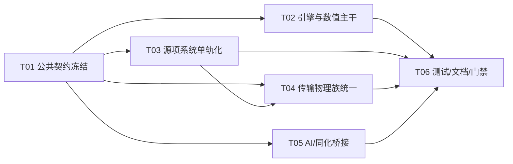

# MariHydro 并行重构总控

更新时间：2026-03-10

## 1. 目的

本目录用于把当前架构重构工作拆解成可并行推进的任务包，供多个 agent/开发者同时执行。

目标不是“写愿景文档”，而是形成可直接开工的工作边界、依赖顺序、冲突规避规则和验收标准。

## 2. 代码现实边界

本计划以当前仓库结构为准：

- Layer 1：`crates/mh_foundation`
- Layer 2 / runtime-like：`crates/mh_physics/src/core`
- Layer 3：`crates/mh_physics/src/*`（除 `core`）
- Layer 4+：`crates/mh_agent`
- workflow/config orchestration：`crates/mh_workflow`

注意：

- 当前仓库没有独立 `mh_runtime` crate。
- 当前仓库没有独立 `mh_config` crate。
- 历史审查报告中出现的失效路径，只能作为“问题来源”，不能作为实施路径。

## 3. 全局原则

1. 以当前代码现实为准，不再引用失效 crate 路径。
2. 计算主路径统一到 `Backend + Scalar` 单轨，禁止继续扩散 legacy/generic 双轨。
3. 任何“占位实现”要么补齐最小可运行版本，要么转为结构化错误并从生产路径隔离。
4. 文档描述必须和代码签名一致，禁止“文档已重构、代码仍兼容”的悬空状态。
5. 一个任务只改自己的边界文件，不擅自跨任务清理。
6. 公共接口只能由任务 01 调整；其他任务只能消费，不得私自扩展。
7. 每个任务都必须附带本任务相关测试/回归，不把验证留给最后一棒。
8. 所有中文文档与注释统一 UTF-8。

## 4. 并行任务总览

| 任务 | 名称 | 负责人建议 | 主要范围 | 依赖 |
| --- | --- | --- | --- | --- |
| T01 | 运行时与公共契约冻结 | Rust trait / 架构负责人 | `mh_physics/src/core`、`types.rs`、`traits.rs`、`mesh/topology.rs`、`adapter.rs` | 无 |
| T02 | 引擎与数值主干统一 | 数值核心负责人 | `engine/*`、`numerics/*`、`schemes/*` | T01 |
| T03 | 源项系统单轨化 | 物理源项负责人 | `sources/*` | T01 |
| T04 | 传输物理族统一 | 输运/多物理场负责人 | `tracer/*`、`sediment/*`、`vertical/*`、`waves/*` | T01，弱依赖 T03 |
| T05 | AI/同化桥接重构 | AI/同化负责人 | `mh_agent/*`、`mh_physics/src/assimilation/*` | T01，建议晚于 T03/T04 接口稳定 |
| T06 | 测试、文档与门禁收口 | QA/发布负责人 | `tests/*`、`docs/*`、`scripts/*` | 贯穿执行，最终收口 |

## 5. 依赖关系

## 6. 合并顺序

建议合并顺序：

1. T01
2. T03
3. T02
4. T04
5. T05
6. T06

说明：

- T01 必须先合并，因为它定义公共接口边界。
- T03 优先于 T04，因为 `tracer/sediment/waves` 会消费源项接口。
- T05 尽量放在 T03/T04 之后，避免 AI 层桥接重复适配。

## 7. 冲突规避规则

### 7.1 公共文件归属

以下文件默认只允许 T01 改签名：

- `crates/mh_physics/src/core/backend.rs`
- `crates/mh_physics/src/core/buffer.rs`
- `crates/mh_physics/src/core/scalar.rs`
- `crates/mh_physics/src/types.rs`
- `crates/mh_physics/src/traits.rs`
- `crates/mh_physics/src/mesh/topology.rs`
- `crates/mh_physics/src/adapter.rs`

### 7.2 允许消费，不允许改接口

T02/T03/T04/T05 可以：

- 调整调用点
- 删除对旧接口的依赖
- 新增局部适配层

但不可以：

- 修改 T01 负责的 trait 签名
- 新增第二套平行接口
- 为了图省事重新引入 `CpuBackend<f64>` 专用路径

### 7.3 任务外文件修改规则

如果某任务需要改动任务外文件，处理方式如下：

1. 先在自己的任务文档里登记“跨边界需求”。
2. 若只涉及调用点，允许修改。
3. 若涉及公共接口本身，必须转回 T01 处理。

## 8. 验收基线

所有任务最终必须共同满足：

- `cargo check --workspace`
- 关键物理回归可运行
- 生产代码 `unimplemented!` 为 0
- 主路径 `CpuBackend<f64>` 专属实现为 0
- `mh_agent` 主路径不再围绕裸 `f64` 快照与独立同化 trait 展开
- 文档不再引用失效 crate 路径

## 9. 问题覆盖说明

本计划覆盖三类问题来源：

1. 用户提供的 AI 审查报告
2. `basicmemory.md` 中已人工核验的问题
3. 当前仓库抽样复核发现的现实问题

问题到任务的完整映射见：

- `docs/parallel_refactor/issue-coverage-matrix.md`

## 10. 使用方式

每个 agent 开工前最少阅读：

1. 本文件
2. 自己对应的任务包
3. `issue-coverage-matrix.md`

任务包列表：

- `task-01-runtime-and-contracts.md`
- `task-02-engine-and-numerics.md`
- `task-03-sources-single-track.md`
- `task-04-transport-physics-family.md`
- `task-05-ai-and-assimilation.md`
- `task-06-tests-docs-and-gates.md`
